# Automation Test Scripts Using Selenium/Java - MAWM
## Pre-requisites :
   -	Required installation.  
         - Java 11 (JDK)
	      - Eclipse/IntelliJ (Latest)  
	   &emsp;- Maven, Cucumber, testNg, lombok and Git plugins.  
           - Git or Git for windows  
           - Mobile testing - we may need to install Appium inspector in local if you want to capture the locators.  
         

- Should be able to download the maven dependancies, if fails please setup the proxy if required.  
**Note**: During plugin installtion you may need admin access or need to disconnect cisco VPN if required.

## Libraries Used :

**Note : All the aforementioned libraries are open-source and does not include any license.**

## Adding more tests :

1. Tests should be added as per the convention followed. 
   - New Cucumber feature file should be created under **src/test/resources/FeatureFiles**
   - New cucumber test steps definitions should be created inside the **src/test/java/stepdefinitions**
   folder.
   - Web UI pages should be created under **src/test/java/test.web.ui.pages**.
   - Mobile UI pages should be created under **src/test/java/test.mobile.ui.pages**.
   - API related business functions can be written under **src/test/java/test.api.BusinessUtils**.
2. Based on the type of tests (Provided at Runmanager), it has to be created inside api or ui/mobile or ui/web.
3. All the tests should be extended to use Test data directly in that class **TestData_Json.java**
4. All the test scenarios entries should be added in runmanager and set the execute flag as required.
5. If needed you can add tags for the scenarios which can be utilized at reporting.
6. All the tests should be follow AAA pattern - **ARRANGE, ACT and ASSERT**

## Running Tests :

1. RunManager should be updated for the scenarios which are needs to be executed.
2. There are multiple ways to run the tests. During development phase you can use TestNG suite to run the execution.
3. Once the setup is completed we can trigger the script by right and run at **testNg_Cucumber.xml**
4. User can also choose the thread-count parameter to run the tests in parallel. In the below picture we have choosen
   the thread-count as '2'. Hence two tests from the given scenarios will run in parallel.
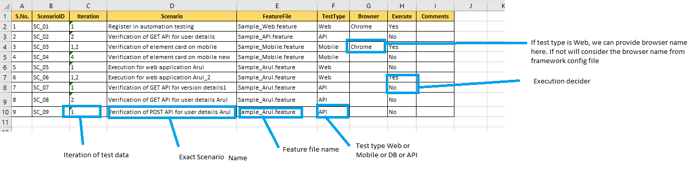

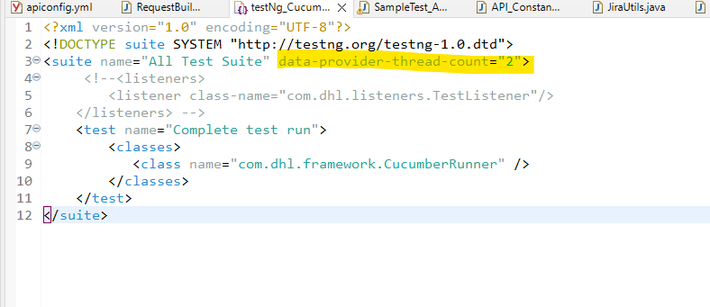

4. User can also choose to run via maven commands which is highly recommended.
5. Maven profiles are configured in the pom.xml. You can run these from IDE Terminal or Windows Terminal inside the
   project folder.

`mvn clean test -Pcucumber` - To run all the different types of tests (web,mobile and api)

## Report Interpretation :

1. Dashboard view clearly indicates the start time, end time of the run, number of tests passed and failed. It also
   shows the time took for the individual tests in form of timeline. Hover the mouse over the timeline to get the exact
   time details.
   - Test report name and title can be updated through the framework config file before starting the execution.

2. Tags tab in the Dashboard view clearly indicates the pass and fail according to the features. Groups tag given
   on top of tests will be picked to categorize the tests based on the features.
   
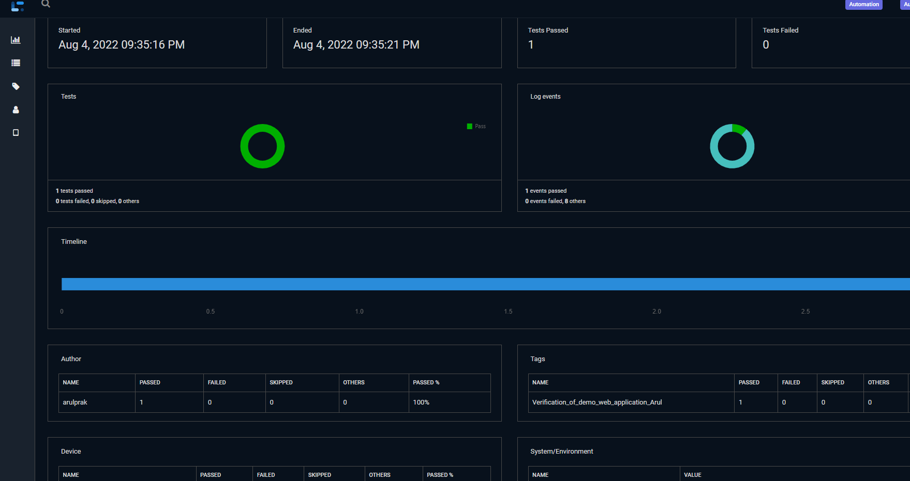

3. The left Tests pane indicated in the below diagram contains the list of all the test run and it's log events.
4. Click on each test tab to view the corresponding test log events.
5. All the tests will have a screenshot attached for each step. Click on the pink base64.img to
   view the screenshot. Else you can enable image thumbnail at config file.
   
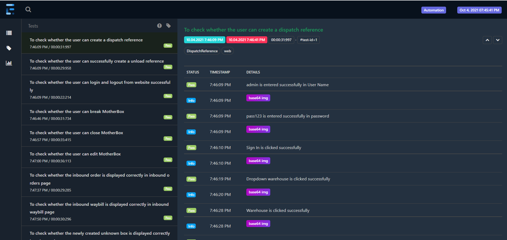

6. All the API tests will have the request endpoint, request body and response body logged in the report for debugging
   purpose. Request body will be marked with info tag and reponse with pass tag for easy interpretation. This is also
   configurable.

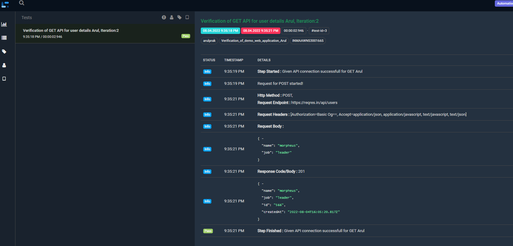

7. After each test run, reports can be found under root directory, **Location**: {**ProjectDirectory**}\**TestReports**\

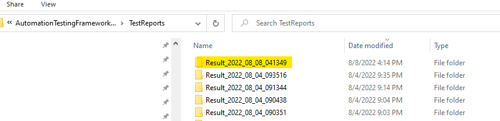

**Inside there are below reports.**  
   &emsp; **TestResults.html:**- Html report which contains the customized framework report.  
   &emsp; **Consolidated_Report.xlsx:**- Excel report which contains the consolidated framework report.  
   &emsp; **ConsoleLog.txt:-** Console Log which will have all the console println.  
   &emsp; **CucumberReports:**- This folder contains the cucumber reports generated by grasshopper which is like summary report of the framework execution.  

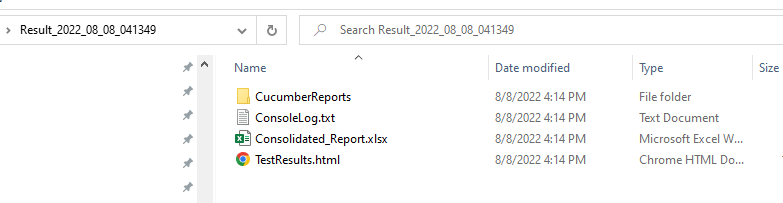

**Cucumber Reports:**  

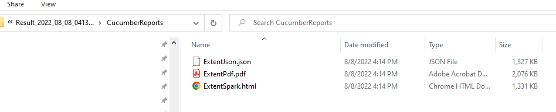

**PDF Report:**

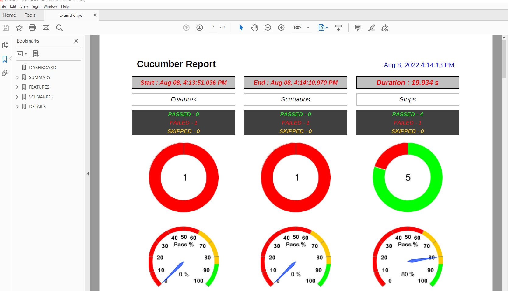

## Jenkins Integration :

1. This project can be integrated in Jenkins.  
2. Login to Jenkins ->Create Maven project and configure as mentioned below  
	- Sample:- Selenium Automation Framework -> Selenium Automation Maven.  

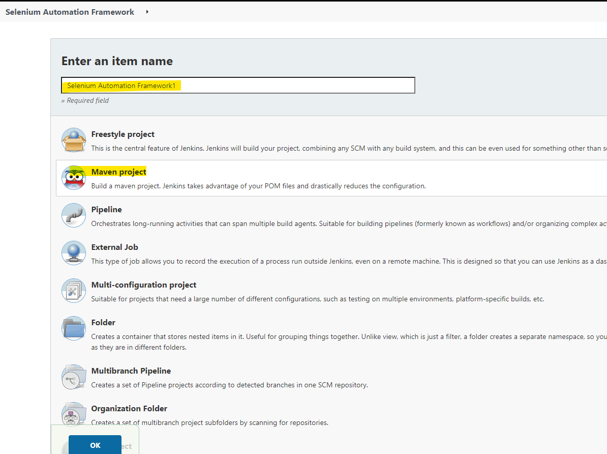

3. Under general section -> Add different choice parameters. If you want to run the parallel execution set the thread count.

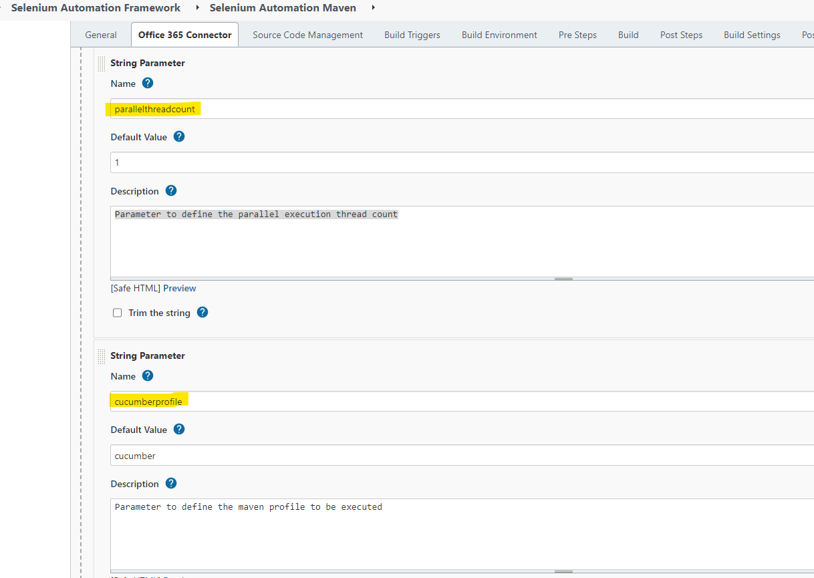

4. Under SCM -> Choose Git repo and branch to be pulled for the run.

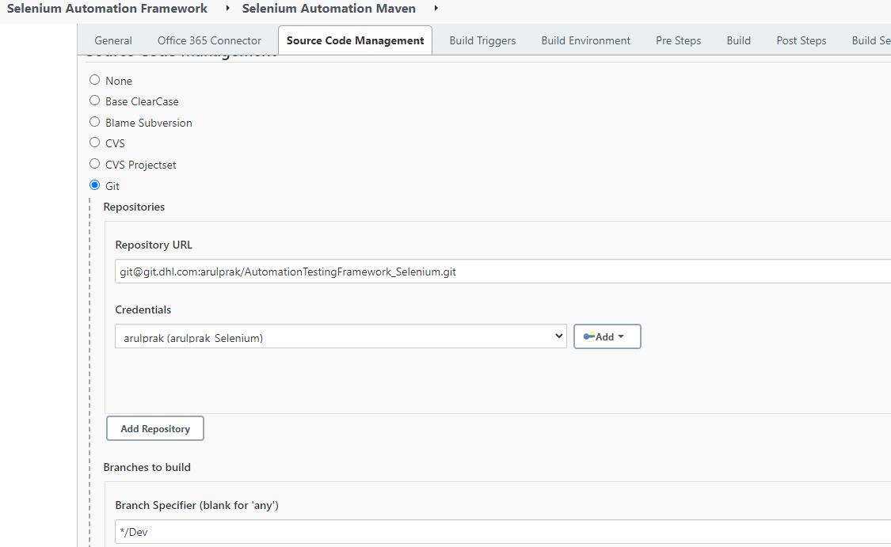

5. Under Build section -> Confiure the pom.xml path and goals to run. Here the ${cucumberprofile} is a variable and value will
   be choosen based on the choice parameter.

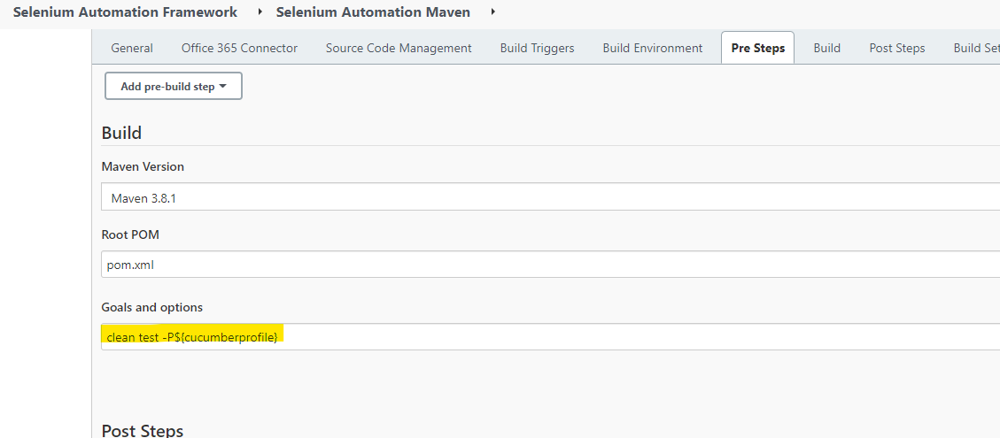

6. Post build section provide the inject environment variable which stores the test cases count at runtime through framework. This will be used at Email body content.

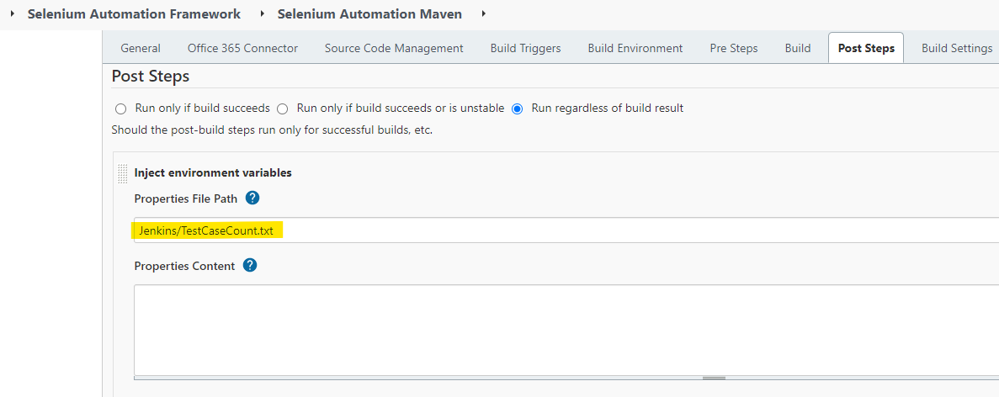

7. If you want cucumber report to be pulished, please add "cucumber.json" file location. 

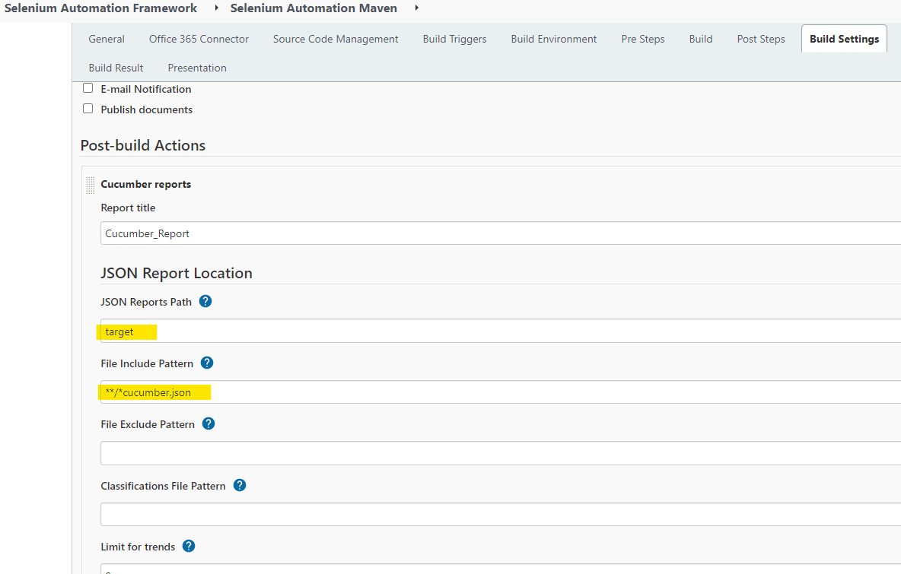

8. We can publish our framework html report in jenkins if required by setting below config.  

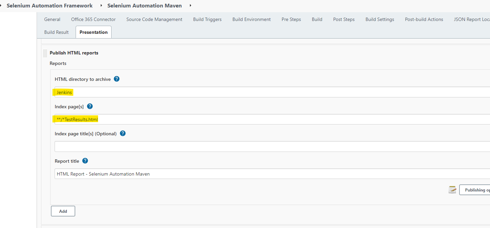

8. To send email after test run with reports. Post Build -> Editable Email Notification -> Choose the recipients, report
   path and email body.

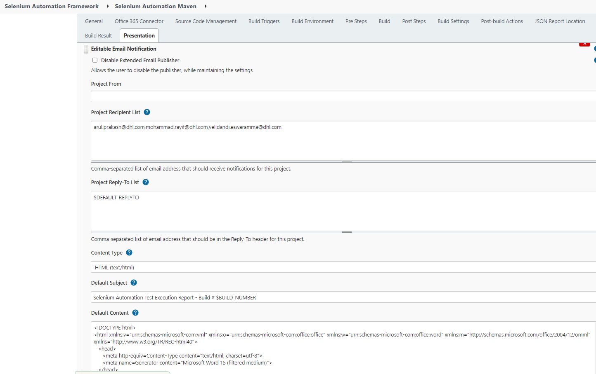

9. Email report will be as shown below.
    

